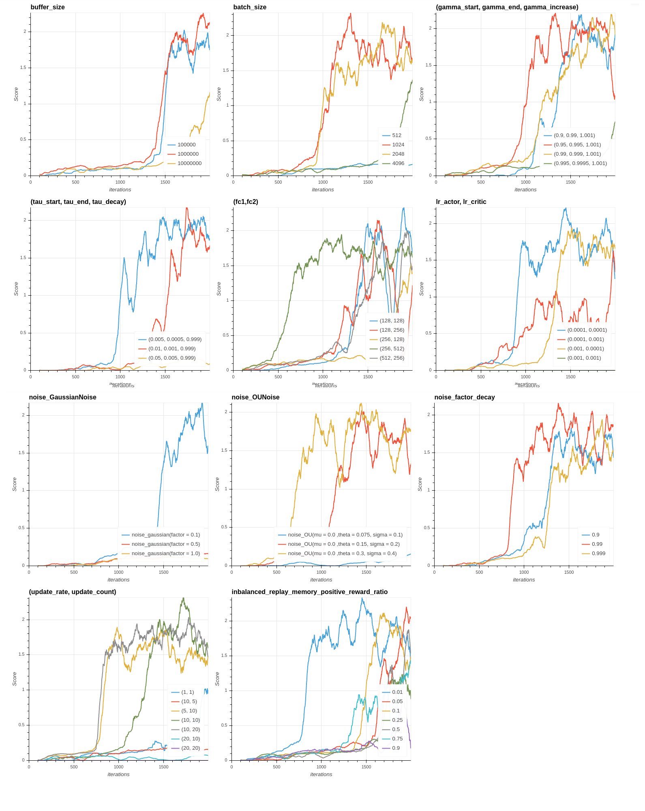
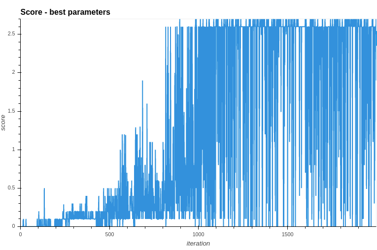
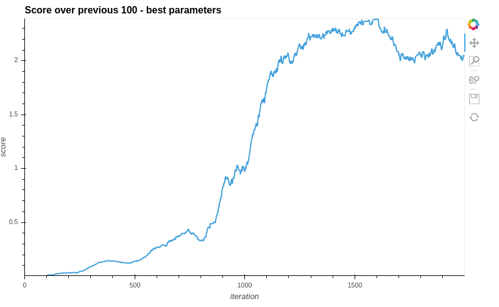

# Report Tennis

## Introduction

This project is part of the [Deep Reinforcerment Learning NanoDegree from Udacity](https://www.udacity.com/course/deep-reinforcement-learning-nanodegree--nd893) . The aim is to train two agents to play tennis. If an agent hits the ball over the net, it receives a reward of +0.1 while if the ball hit the ground or if the agent hits the ball out of bounds, its receives a reward of -0.01. The goal of each agent is to keep the ball in play as long as possible.

The project involves the Tennis environment from the [Unity Machine Learning Agents Toolkit (ML-Agents Toolkit)](https://github.com/Unity-Technologies/ml-agents). It is an open-source project from Unity that offers various environments for training intelligent agents. It is designed to ease the training of agents by defining environments that offer observations, actions and rewards.

The state space of the Tennis environment has 24 variables for each agent. In Tennis, each action is a vector with four 2 numbers. Every entry in the action vector should be a number between -1 and 1.  

The tennis task is epsiodic and the environment is considered solved if we get an average score (over 100 consecutive episodes by taking the maximum over both agent).

## Technical settings

As part of the Deep Reinforcement Learning course, this project reuses the source code offer by the course. Especially, it is derived from the following Deep Determinic Policy Gradient implementation : [ddpg-pendulum](https://github.com/udacity/deep-reinforcement-learning/tree/master/ddpg-pendulum). The agent has been trained locally using PyTorch with Cuda involving an *Intel core i7 7700HQ*, *16Gb RAM* and a *Nvidia GP107* GPU.

## Solution

The Tennis environment is solved using a DDPG (Deep Determinic Policy Gradient). Common reinforcement learning techniques as DQN could not be applied here since it only apply to discrete action spaces in the sense that it searches for the action that maximize the action value function at each iteration.

First, we tried to solve the environment using the code of the code from the course ( [ddpg-pendulum](https://github.com/udacity/deep-reinforcement-learning/tree/master/ddpg-pendulum)). 

We implemented gradient clipping  when training the critic network. Each agent adds its experience to a replay buffer that is shared by all agents. The (local) actor and critic networks are updated in a parameterizable rates with a parameterizable number of iterations. These hyper parameters are adjusted in the next sections.

To improve the learning behavior of this agent, we choosed to investigate other aspects of our DDPG agent:

- **the hyperparameters** : We choosed to try to find the best values for the a set of impacting parameters.
- **the noise applied on the actor output to ease exploration** : The implementation from the course uses an Ornstein-Uhlenbeck process but we found that some papers (such as [Distributed Distributional Deterministic Policy Gradients](https://arxiv.org/pdf/1804.08617.pdf)) just suggest other noises like Gaussian noises.

We also read carefuly the [implementation of ShangtongZhang](https://github.com/ShangtongZhang/DeepRL) introduced in the course and found some tweaks like initializing the weights of the target networks with the same values as the local network.

## Imbalanced the sampling of the experience replay

Our manual experiments reveal that the nature of the experiences in the replay buffer change a lot during the training. More precisely, during the first hundreds of iterations, the buffer is full of experiences with negative rewards (the ball is missed). As long as the agents learn, there is more and more positive experiences and a the end, the buffer is almost full of experiences with positive rewards.

The training behavior shows the following two detrimental characteristics:
- during the first hundreds iterations (depending of the hyper parameters), in average the 800 first, the agents perform badly and it takes many time since it is able to hit the ball.
- at a given point, our agents perform very well but in some contexts (depending on the hyperparameters), its performances start to decrease.

We have the feeling that these two behaviors may rely on the huge change in the ratio between experiences with positive rewards (hit the ball) and those with negative regative rewards. Maybe at the beginning of the training, experiences with positive rewards contain more usefull information for the agent to learn but are too rare. Inversly, a good agent may at a given time miss negative experiences in the buffer which could bias it.

To check this hypothesis, we implemented what we call "imbalanced experience replay". In this approach, we have two experience buffers : one for the experiences with negative rewards and one for the experiences with positive rewards. Every time we sample the memory, we extract a particular ratio of experiences with positive rewards and negative rewards. This ratio is ruled by an hyperparameter **inbalanced_replay_memory_positive_reward_ratio** that gives the ratio of the total experiences to sample that should have positive rewards. A more refined approach would be to use prioritized experience replay that has been discussed in the course.

## Parameterization

The DDPG algorithm applied to the tennis environment introduces many parameters we can play on to speed up the convergence and the final score of the trained agent :

- **buffer_size** : The size of the replay buffer in the context of the *Experience replay*,
- **batch_size** : The size of the batch involved in the update enhanced using *Experience replay*,
- **gamma_start** : The discount factor at the beginning of the training. We choosed to make it varying during the training on the basis of the following consideration : at the beginning of the training, our agent is very naive and we feel that it should target immediate actions in the hope to just hit the ball. As long as it performs better, we reduce the discount rates so that he will be able to explore some more long terms strategy.
- **gamma_end** : The maximum discount factor allowed for the agent regarding the strategy introduced above,
- **gamma_increase** : The coefficient to apply to gamme after each episode in the context of the above strategy,
- **tau_start** : the starting value for the interpolation parameter for the update of the weights of the neural networks. The idea is to start with an aggressive value and to lower the update during the training.
- **tau_end** : the lowest value for the update of the interpolation parameter for the update of the weights of the neural networks.
- **tau_decay** : the coefficient to apply after each episode to reduce the interpolation parameter for the update of the weights of the neural network.
- **(fc1, fc2)** : the size of the first and the second layer of the fully connected neural networks that are used for the actor and for the critic. Both networks are shared by the two agents in our implementation.
- **lr_actor** : the learning rate of the neural netowrk of the actor,
- **lr_critic** : the learning rate of the neural netowrk of the critic,
- **noise** : the noise applied on the actor output to ease exploration, we test different parameterizations of the Ornstein-Uhlenbeck process suggested in the course but also test different gaussian noises.
- **noise_factor_end** : the lowest normalizing coefficient for the random distribution generated by the noise. We start with value 1 and reduce the coefficient apply to the noise after each episode to lower the induced exploration.
- **noise_factor_decay** : the coefficient to apply to reduce after each epsiode the coefficient apply to the noise (to lower exploration),
- **update_rate** : the frequency in terms of number of time steps at which to update the networks
- **updates_count** : the number of update of the policy at each update.
- **inbalanced_replay_memory_positive_reward_ratio** : gives the ratio of the total experiences to sample that should have positive rewards. Since it is a proposal driven by our intuition, we will test various ratios.

Setting the right values for these parameters is not obvious. We propose the following approach to find a good distribution of hyper parameters : We start with a mix of values that are close to those advised in the litterature and values we found usefull during our preliminary manual tests :

- **buffer_size** : 10000,
- **batch_size** : 1024,
- **(gamma_start, gamma_end, gamma_increase)** : (0.95, 0.995, 1.001),
- **(tau_start, tau_end, tau_decay)** : (0.01, 0.001, 0.999),
- **(fc1, fc2)** : (256, 256)
- **(lr_actor, lr_critic)** : (0.0001, 0.0001)
- **noise** : Gaussian distribution with mean 0 with standard deviation 0.5.
- **noise_factor_end** : 0.01 (almost no randomness).
- **noise_factor_decay** : 0.99 : slow decrease
- **(update_rate, update_count)** : (20, 20)
- **inbalanced_replay_memory_positive_reward_ratio** : disabled (we have no idea if it could work)

Since the training of the agent is time consuming, we chosed the following simple heuristic approach to find a good value for each hyper parameter. For each parameter, we introduce a list of values to test. Among those values, the one we keep is the one that leads to the fastest convergence.

More specificaly, we test the followings values :

- **buffer_size** : [10000, 100000]  (try to enlarge the buffer)
- **batch_size** : [512, 1024, 2018] 
- **(gamma_start, gamma_end, gamma_increase)** : (0.9, 0.99, 1.001), (0.95, 0.995, 1.001), (0.99, 0.999, 1.001), (0.995, 0.9995, 1.001) : try various discount factors with same increase rate stategy.
- **(tau_start, tau_end, tau_decay)** : (0.005, 0.0005, 0.999), (0.01, 0.001, 0.999), (0.05, 0.005, 0.999) : try various interpolation parameters for the neural networks weights, with same decrease strategy,
- **(fc1, fc2)** : (128, 128), (128, 256), (256, 128), (256, 512), (512, 256) (test different networks. In first place, manual tests showed that layer sizes between 128 and 512 seems to fit well for this environment),
- **lr_actor, lr_critic** : [(1e-4, 1e-4), (1e-4, 1e-3), (1e-3, 1e-4), (1e-3, 1e-3)] (the litterature advises learning rates between 1e-3 and 1e-4, we test all the combinations here for the actor and the critic)
- **noise** : We test Gaussian distributions  with mean 0 and standard deviation in 0.1, 0.2, 0.4 and 1  and Ornstein-Uhlenbeck process with (theta, sigma) in {(0.075, 0.1), (0.15, 0.2), (0.3, 0.4)}.
- **noise_factor_decay** : 0.9, 0.99, 0.999 : we try to decrease the noise at various speed,
- **(update_rate, update_count)** : (1, 1), (10, 5), (5, 10), (10, 10), (10, 20), (20, 10), (20, 20) : we try many configuration for the updates of the neural network,
- **inbalanced_replay_memory_positive_reward_ratio** : 0.01, 0.05, 0.1, 0.25, 0.5, 0.75, 0.9 : we try various ratio of experiences with positive rewards in the experience replay strategy. 

When a value is "tested", we train a new agent for 2000 episodes with the adjusted parameter set to this value while the other parameters are set to the default values.

Testing each parameter value for 2000 iterations gave us the following graphics where we plot the average score on the previous 100 iterations :

For each parameters, we draw the following conclusions :

- **buffer_size** : Values 100000 and 1000000 give results that are close while alue 10000000 seems to large. We keep as best value 10000000.

- **batch_size** : batches of size 1024 seems the best option. Too large and too small values (512 and 4096) do not induce a good convergence.
- **(gamma_start, gamma_end, gamma_increase)** : The triplet (0.95, 0.995, 1.001) dominates the other values.

- **(tau_start, tau_end, tau_decay)** : Value (0.005, 0.0005, 0.999) induces the fastest convergence. We can see that with the highest tested value, the agent does not converge.

- **(fc1, fc2)** : 256 units on the first layer and 512 on the other is the option that gives the best stability and that converged the fastest.

- **lr_actor, lr_critic** : We choose a learning rate of 0.0001 both for actor and critic since it gives the best results.

- **noises** : The noises based on the Ornstein-Uhlenbeck process performs better, especially with theta = 0.3 and sigma = 0.4. 

- **noise_factor_decay** : A noise decreasing factor with value 0.99 applied after each episod performs better.

- **(update_rate, update_count)** : The pair (10, 20) induces the fastest convergence and seems to offer a good stability.

- **inbalanced_replay_memory_positive_reward_ratio** : The value 0.01 induces a fast convergence, with a good stability. For our final agent, we choose to keep the inbalance in the sampling of the experience replay.

Regarding the results, we choose to keep the following values :

- **buffer_size** : 1000000,
- **batch_size** : 1024,
- **(gamma_start, gamma_end, gamma_increase)** : (0.95, 0.995, 1.001) 
- **(tau_start, tau_end, tau_decay)** : (0.005, 0.0005, 0.999)
- **(fc1, fc2)** : (256, 512)
- **noises** : Ornstein-Uhlenbeck process with theta = 0.3 and sigma = 0.4. 
- **noise_factor_decay** : 0.99
- **(update_rate, update_count)** : (10, 20)
- **inbalanced_replay_memory_positive_reward_ratio** : At each replay memory sampling, we try to keep 1 % of experience with positive rewards.

## Results

Given our distribution of hyper-parameters, we get the following results :

 
Since this curve is very noisy due to fluctuation in scores between epsiodes, we can plot the score on the previous 100 iterations, which gives us :

 
Our agent get an average score higher than 0.5 at iteration 860 and continues to improve (above 1.0 in the last 100 iterations at iteration 963) until reaching an average score around 2.

## Perspectives

### Improve current DDPG approach

We would like to try prioritized experience replay instead of the very simple modification we performed on the experience sampling. 

### Implement new algorithm

Instead of using the DDPG (Deep Determinic Policy Gradient) algorithm, we would like to try other approaches. Especially, the [Distributed Distributional Deterministic Policy Gradients algorithm](https://arxiv.org/pdf/1804.08617.pdf) retained our attention. Proximal Policy Optimization is another alternative that seems worth a try.

### Refine hyper-parameters tuning

We proposed a naive approach to find our distribution of hyper parameters. The litterature is full of more structurated approaches to achieve such this task (Grid search, Random search, etc.). Some Python libraries propose high level frameworks (for instance Scikit Learn) for common approaches (Grid search, Random search, etc.). That said, this reacher environment is now easily solved with my current implementation and the refinement should take place on a more challenging environment.

